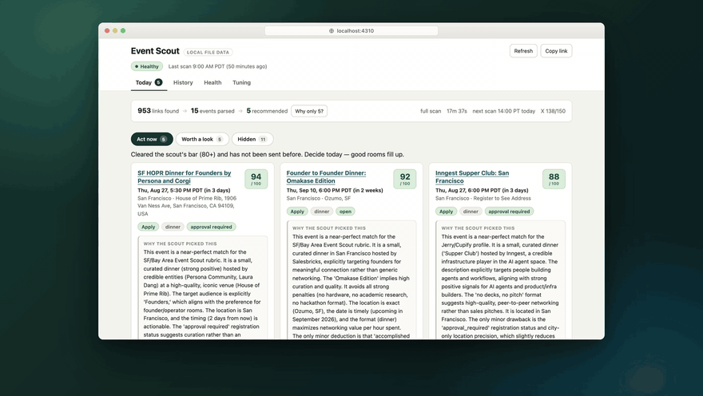
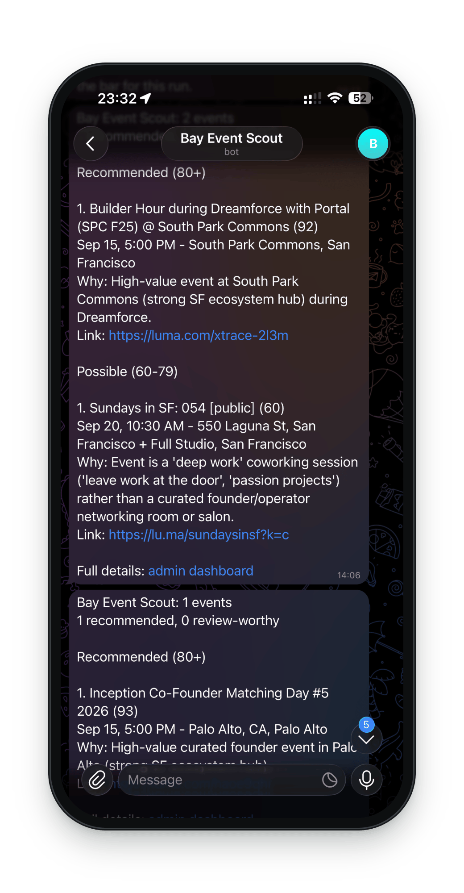

# Bay Area Event Scout

English | [中文](README.zh-CN.md)

**The best rooms in SF are small, and they fill up fast.** This scout finds high-signal SF Bay
Area events for founders, operators, and investors: the dinners, salons, and roundtables that
rarely make the big event calendars. It searches public calendars, newsletters, the web, and X,
reads each event page, scores it against **your** preferences, and sends a short digest to
Telegram, plus a dashboard your team can triage.

<p align="center">
  <a href="https://github.com/Jerry-111/bay-area-event-scout/releases/tag/v0.1.0">
    
  </a>
  <br>
  <sub>A real scan from August 24, 2026, replayed in the dashboard: 953 links → 15 events → 5 picks.
  <a href="https://github.com/Jerry-111/bay-area-event-scout/releases/tag/v0.1.0">Watch the full demo in HD</a>.</sub>
</p>

- **Wide discovery.** Beyond Luma's public pages, it scans 100+ curated Bay Area calendars, digests,
  and newsletters. It also uses the official X API to catch events that hosts only share on X. An
  LLM planner adds fresh search queries every run, so the scout doesn't keep asking the same questions.
- **Your preferences, in plain words.** Topics you want more or less of, formats, people, venues,
  hard no's, and the score bar live in one [scout profile](docs/profiles.md). Start from a preset
  (B2B SaaS, climate tech, fintech, consumer AI), or describe yourself in a sentence. Change it later
  the same way, e.g. "add climate tech, no crypto".
- **Bring your own LLM.** OpenAI, Anthropic, Gemini, DeepSeek, Qwen/DashScope, OpenRouter, Ollama,
  or any OpenAI-compatible endpoint. See [LLM providers](docs/llm-providers.md).
- **Explainable scores.** Every event gets a 0-100 score with a breakdown and a rationale that names
  which of your preferences moved it. See [scoring](docs/scoring.md).
- **Cheap to run, and you choose the budget.** The default GitHub setup costs about $6 a month;
  see [setup and costs](docs/setup-and-costs.md).

## What you get



**A short Telegram digest after every scan.** Only the events that clear your bar, each with its
score, time, place, one line on why it fits you, and the link. Near misses come in a separate
list, so a good event that scored a little low still reaches you. The screenshot is a real digest.

**A dashboard to triage with your team:**

- **Act now:** today's picks, each with the scout's reasoning.
- **Worth a look:** events just under the bar, and what held them back.
- **Hidden:** good events kept out of the digest because you've already seen them, so nothing
  repeats.

Every score opens into a breakdown (fit, room quality, networking, timeliness, location,
novelty, evidence), and every card has feedback buttons for your team.

<br clear="right">

## Where it looks

A curated list of 100+ Bay Area sources, plus fresh web searches that an LLM planner writes for
each scan:

- **Community calendars:** AI Tinkerers SF, South Park Commons, Founders Inc, Cerebral Valley,
  AGI House, Frontier Tower, The AI Collective, Bond AI, Bay Area Founders Club, Latent.Space,
  LangChain SF, AICamp, and dozens more groups on Luma and Meetup.
- **Campuses, venues, and funds:** YC Startup School, StartX, Berkeley SkyDeck, Stanford HAI,
  Entrepreneurs First, AWS Builder Loft, SHACK15, Pear VC, SignalFire, Fusion Fund.
- **Event roundups and newsletters:** Gary's Guide, Sam's Guide, FounderCal SF, TLDR EVENTS,
  Fog City Events, Eddie's List, Kyosuke's Newsletter.
- **X** (optional, through the official API), for events hosts only announce there.

The full list is in [`source-registry.ts`](packages/discovery/src/source-registry.ts), and your
profile can [add or turn off](docs/profiles.md) any source.

**Not in the Bay Area?** Set your city as the region in your profile and add your local
calendars. The searches, the page reading, and the scoring all follow the region; see
[Region](docs/profiles.md#region). If you put together a good source list for your city, please
[share it in an issue](https://github.com/Jerry-111/bay-area-event-scout/issues/new?template=new_source.md).

## Three ways to run it

| | Scans | Dashboard | Setup | Cost to run |
| --- | --- | --- | --- | --- |
| **1. Local** | On your computer, when you ask | On your computer | Install Node.js, run `npm start` | Free |
| **2. Cloud** | On GitHub, twice a day, even when your computer is off | On your computer, reading a free database | About 15 minutes in the browser, plus Node.js for the dashboard | Free |
| **3. Team** | On Trigger.dev, three times a day | On a server everyone can open | A terminal, and three services you deploy yourself | About $5–25 a month for the server |

1. **[Local](#on-your-computer)**: the quickest way to try it, and all you need for occasional scans.
2. **[Cloud](docs/github-actions.md)**: for most people who want the picks every day. Scans run on
   GitHub Actions and send the digest to Telegram. Results go to a free [Neon](https://neon.com)
   database, which the dashboard on your computer reads.
3. **[Team](docs/operations.md)**: for a team sharing one online dashboard. Trigger.dev runs the
   scans, Postgres keeps the history, and you host the dashboard (Railway or any Node host).

All three send the digest to Telegram if you set up a bot.

## What it costs

Trying it with sample data is free. For real scans, you pay each provider directly. A budget
setting caps what one scan may use, and you choose how many scans a day:

| `SCOUT_BUDGET` | Per scan | 1 scan a day | 2 a day (GitHub default) | 3 a day |
| --- | ---: | ---: | ---: | ---: |
| `small` (GitHub default) | ~$0.25 | ~$2/month | ~$6/month | ~$13/month |
| `medium` | ~$0.50 | ~$5/month | ~$20/month | ~$35/month |
| `large` | ~$1 | ~$19/month | ~$48/month | ~$77/month |

X, if you add it, is searched once a day: about $4, $8, or $23 more a month for small, medium,
or large. Only an LLM key is required. Telegram (free) and Exa are recommended; X and Firecrawl
are optional. [Setup and costs](docs/setup-and-costs.md) walks through getting each key, step by
step, and compares LLM prices.

## On your computer

You need **Node.js 22 or newer**. If you don't have it, download the LTS installer from
[nodejs.org](https://nodejs.org/en/download) and run it (one time). Then, in a terminal:

```sh
git clone https://github.com/Jerry-111/bay-area-event-scout.git
cd bay-area-event-scout
npm start
```

No git? On GitHub, click **Code → Download ZIP**, unzip it, and open a terminal in that folder.
On a Mac: open Terminal, type `cd ` (with a space), drag the folder onto the window, and press
Enter. On Windows: open the folder, click its address bar, type `cmd`, and press Enter. Then run
`npm start`.

That's the only command you need. The first time, `npm start` installs everything (a minute or
two) and asks a few setup questions. Press Enter to skip any of them; without an LLM key you
see sample data. Then it opens the dashboard in your browser. After that, `npm start` shows a
short menu:

```text
What would you like to do?
  1) Scan for new events, then open the dashboard (last scan: 2 days ago)
  2) Open the dashboard
  3) Show or change my preferences
  4) Change keys, Telegram, budget, or preferences (setup)
  5) Check my setup
```

A scan takes 3–10 minutes and shows its progress as it goes. The dashboard stays up until you
press Ctrl+C. Shortcuts skip the menu: `npm start scan`, `npm start dashboard`,
`npm start setup`, `npm start preferences`, `npm start undo`, and `npm start doctor`.

Setup saves your keys in `.env.local` (gitignored, readable only by you) and results in
`.scout-data/`. Developers can use the `pnpm` commands under [Commands](#commands) to run each
step on its own.

## Make it yours

Your preferences (the "scout profile") drive everything: the searches, what gets filtered out
before any LLM spend, the scoring prompt, and the score bar. You never have to touch YAML.
Run `npm start preferences` (or pick it from the menu): it shows what the scout looks for now and
asks what to change, for example "more B2B go-to-market dinners, add climate tech, no crypto".
`npm start undo` puts the previous version back. With pnpm, the same things work as one-liners:

```sh
pnpm profile:show                                     # what the scout is looking for now
pnpm profile:edit "more B2B go-to-market dinners, add climate tech, no crypto"
pnpm profile:new "I run partnerships at a B2B SaaS startup and want small dinners with founders and buyers"
pnpm profile:undo                                     # changed your mind? (run again to redo)
```

`profile:edit` and `profile:new` use your own LLM key. The LLM rewrites the profile, the result is
checked against the profile rules, and you see a plain list of what would change before anything
is saved. Any language works. To start from a preset instead, set `SCOUT_PROFILE` in `.env.local`
to `b2b-saas-founder`, `climate-tech`, `fintech`, or `consumer-ai-founder` (the default).

Under the hood, a profile is a readable YAML file, if you'd rather edit it yourself:

```yaml
persona: a climate tech founder who wants small rooms with climate investors and corporate buyers
topics:
  - name: Climate tech
    weight: 8          # boosts matching events; negative weights penalize
    keywords: [climate tech, clean energy, decarbonization, grid, battery]
exclude:
  formats: [hackathon, webinar]   # dropped before any LLM call
search:
  phrases: [climate tech founders, climate investors]
thresholds:
  recommend: 80
  review: 65
```

Every field is explained in [docs/profiles.md](docs/profiles.md).

## Run it on a schedule

- **Cloud (free):** [GitHub Actions](docs/github-actions.md) scans twice a day in your own private
  copy (set `SCANS_PER_DAY` for 1 or 3), sends the digest to Telegram, and looks back once a week
  for events the scans missed.
- **Team:** run the worker on [Trigger.dev](https://trigger.dev) (09:00, 14:00, and 22:00 Pacific,
  plus the weekly look back). Store results in Postgres, and host the dashboard on Railway or any
  Node host with `ADMIN_PASSWORD` set. See [operations](docs/operations.md) and
  [admin deploy](docs/admin-railway-deploy.md).

## How it works

```
your profile ─┬─> query packs + LLM search planner
              │         │
              │         v
              │   discovery: Exa · X API · public calendars · RSS · Luma seeds
              │         │
              ├─> pre-filter (profile exclusions, past dates) ──> rejected, with reasons
              │         │
              │         v
              │   page fetch (Firecrawl or plain fetch) ─> LLM extraction ─> dedupe
              │         │
              └─> LLM scoring + profile topic weights ─> thresholds ─> digest + dashboard
```

More detail: [discovery](docs/discovery.md), [scoring](docs/scoring.md),
[source strategy](docs/free-source-strategy.md).

## Commands

| Command | What it does |
| --- | --- |
| `npm start` | Everything in one place: install, setup, scan, dashboard, preferences (a menu) |
| `pnpm onboard` | Guided setup of `.env.local`, your budget, and your preferences |
| `pnpm scout:doctor` | Configuration checklist (`--live` tests keys; `pnpm config:check` prints JSON) |
| `pnpm profile:show` | Show your preferences in plain language |
| `pnpm profile:edit "<change>"` | Change your preferences with a sentence |
| `pnpm profile:new "<description>"` | Write new preferences from a description |
| `pnpm profile:undo` | Undo the last preferences change (run again to redo) |
| `pnpm scout:mock` / `pnpm scout:real` | Run a scan on sample data / for real |
| `pnpm admin` | Dashboard at http://127.0.0.1:4310 |
| `pnpm telegram:chats` | List the Telegram chats that messaged your bot, with their ids |
| `pnpm telegram:test` | Send a test message with your Telegram settings |
| `pnpm test` | Typecheck and run all tests |

## Repository layout

- `apps/worker`: scheduled scans and the weekly miss hunt (Trigger.dev tasks in `src/trigger`)
- `apps/admin`: the dashboard, with feedback buttons for your team
- `packages/discovery`: connectors, query packs, the source registry, candidate filtering
- `packages/intelligence`: page fetching, the LLM client, extraction, scoring, dedupe, profile editing
- `packages/notify`: the digest and Telegram
- `packages/db`: Postgres, local-file, and in-memory storage
- `packages/shared`: env loading, budgets, the profile schema, LLM provider configuration
- `profiles/`: preset profiles
- `scripts/`: `onboard`, `doctor`, the `profile:*` commands, and `telegram:chats`
- `.github/workflows/`: CI, plus the Scout, Preferences, and Telegram chat id workflows for GitHub Actions

## Contributing

Suggestions for new sources (in the Bay Area or your own city), profile presets, and LLM providers
are especially welcome.
See [CONTRIBUTING.md](CONTRIBUTING.md); security issues go through [SECURITY.md](SECURITY.md).

If the scout finds you a good room, a ⭐ on the repo helps other founders find it too.

## Responsible use

The scout reads public pages and official APIs only. It does not log in to Luma, LinkedIn, Meetup,
or Eventbrite, does not automate the X website, and does not collect attendee or profile data.
Respect each platform's terms and rate limits when you raise the budget caps.

## License

[MIT](LICENSE)
